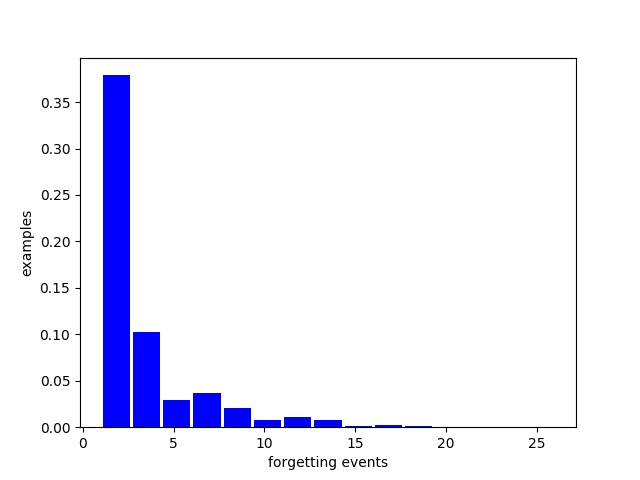

## An Empirical Study of Example Forgetting during Deep Neural Network Learning
- Paper : https://arxiv.org/abs/1812.05159

## 논문 구현
* forgetting examples는 많이 잊혀진 데이터들부터 삭제
* unforgetting examples는 먼저 학습된 epoch을 기준으로 빨리 학습된 데이터들부터 삭제

## 파라미터
* --remove : 데이터를 삭제할 것인지 아닌지 설정 : 'remove' or else
* --mode : forgettable example, unforgettable example 둘 중 하나를 사용할 것인지 : 'forgettable' or 'unforgettable'
* --sort : 오름 차순 정렬 or 내림 차순 정렬을 할 것인지 오름차순 : 'reverse'(5->4->...->1) , 내림차순 : else (1->...->4->5) 
* --remove_ratio : 데이터를 얼마만큼 삭제할 것인지 : 5 (forgettable example들 중 5% 만큼 데이터를 삭제)
* --forget_histroy : forgetting_histroy가 저장되어 있는 위치 경로 

## main.py
``` 
# python main.py --save_path ./forgettable/5/ --remove remove --mode forgettable --remove_ratio 5 --sort reverse --gpu_id 6

``` 


